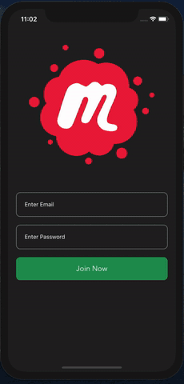

# Fully featured Chat App

##### Technologies used

- React Native
- Styled components
- Lotte animations
- firebase

##### Preview



#### Instructions to run application

- Clone the repo
- install packages using your favourite package manager
- Add .env file and update properties

```
apiKey=
authDomain=
databaseURL=
projectId=
storageBucket=
messagingSenderId=
appId=
measurementId=
```

- run yarn ios / yarn android to open app in corresponding simulator
